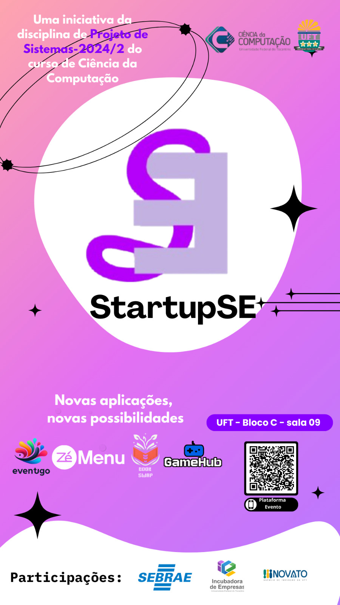
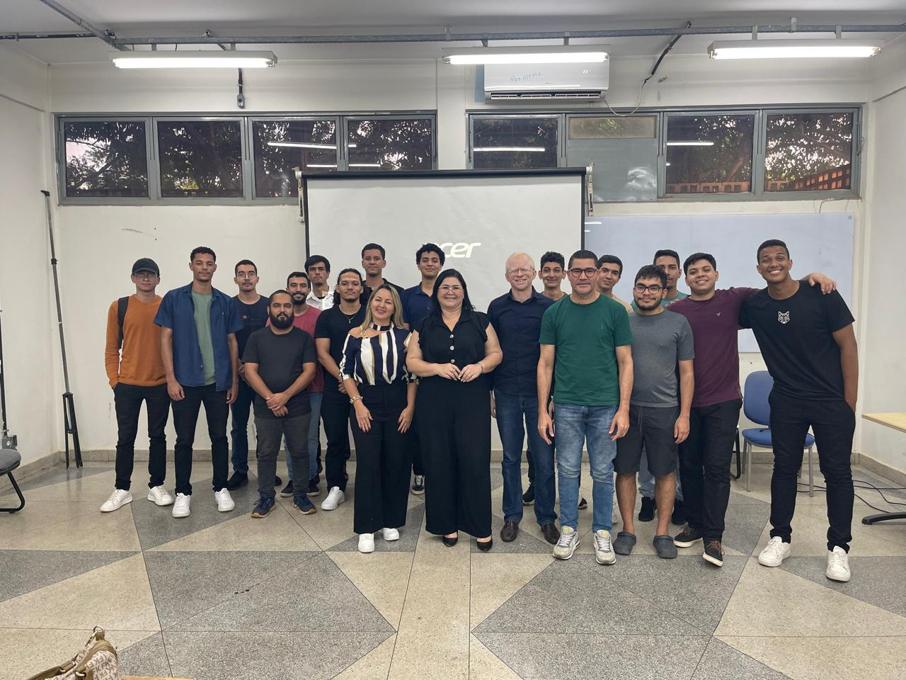

# Projeto de Sistemas - 2024.2 | Universidade Federal do Tocantins - Palmas
#### Curso: Bacharelado em Ciência da Computação
#### Professor: Edeilson Milhomem da Silva

---
# Índice

- [Evento](#evento)
  - [StartupSE](#startupse)
    - [Logo](#logo)
	- [Fotos do Evento](#fotos-do-evento)
	  - [Fotos da Banca](#fotos-da-banca)
	  - [Fotos da Turma](#fotos-com-a-turma)

- [Grupos](#grupos)
  - [Grupo 1](#grupo-1)
    - [EventuGO](#descrição-do-produto)
  - [Grupo 2](#grupo-2)
    - [ZéMenu](#descrição-do-produto)
  - [Grupo 3](#grupo-3)
    - [BookSwap](#descrição-do-produto)   
  - [Grupo 4](#grupo-4)
    - [GameHub](#descrição-do-produto)

---

# Evento

## Instituições:
Agência de Inovação da Universidade Federal do Tocantins (Inovato)  
SEBRAE Tocantins  
Incubadora de Empresas da Universidade Federal do Tocantins  

## Representantes
Inovato: 
Vanderlan Carneiro Dias

Sebrae: 
Adelice Thomaz Soares Novak

Incubadora:
Maria Joaquina Barbosa Goulart

## StartupSE

## Logo

## Fotos do Evento

### Fotos da Banca

### Fotos com a Turma

---
# Grupos

### Grupo 1:

#### Descrição do produto:
O Eventugo é uma solução desenvolvida para facilitar a gestão de créditos em eventos, substituindo as tradicionais comandas físicas por um sistema digital. O projeto visa criar uma experiência mais conveniente e segura para os participantes, que poderão recarregar e utilizar seus créditos por meio de um aplicativo móvel. O sistema permite a realização de transações utilizando QR codes, com visualização de saldo em tempo real e acompanhamento do histórico de transações.
 
 

| Nome                                                              | Github                                         |
|-------------------------------------------------------------------|------------------------------------------------|
| Daniel Reis Aruda Sales                                           | [@Danielpyreis](https://github.com/Danielpyreis)|
| Douglas Ribeiro Santos de Sá                                      | [@XDougSa](https://github.com/XDougSa)         |
| Eliézer Alencar Moreira                                           | [@Liezy](https://github.com/Liezy)             |
| Ícaro Mesquita Ponce                                              | [@icarompo](https://github.com/icarompo)       |
| Murilo Rodrigues Pereira                                          | [@murilortu](https://github.com/murilortu)     |
| [Link do repositório](https://github.com/Liezy/EventuGO)          |                                                |
| [Link da Landing Page](https://eventugo.netlify.app/)                     |                                                |
| [Link do Vídeo Comercial](https://github.com/disciplinas-prof-Edeilson-UFT/proj-sist-2024-2/blob/main/EventuGO/V%C3%ADdeo%20Comercial.mp4)                   |                                                |
| [Link do Vídeo Técnico](https://github.com/disciplinas-prof-Edeilson-UFT/proj-sist-2024-2/blob/main/EventuGO/V%C3%ADdeo%20T%C3%A9cnico.mp4)                   |                                                |
| [Link da Apresentação Técnica](https://github.com/disciplinas-prof-Edeilson-UFT/proj-sist-2024-2/blob/main/EventuGO/Apresenta%C3%A7%C3%A3o%20T%C3%A9cnica.pdf)                   |                                                |
| [Link da Apresentação Comercial](https://github.com/disciplinas-prof-Edeilson-UFT/proj-sist-2024-2/blob/main/EventuGO/Apresenta%C3%A7%C3%A3o%20Comercial.pdf)                   |                                                |

---

### Grupo 2:

#### Descrição do produto:
ZéMenu é um sistema inovador de gerenciamento de pedidos desenvolvido por alunos, que visa modernizar o atendimento em restaurantes. Com ele, os clientes fazem seus pedidos diretamente pelo tablet fornecido pelo estabelecimento, tornando o processo mais rápido e preciso. Nossa proposta é facilitar a operação dos restaurantes, reduzir erros e custos e melhorar a experiência do cliente com o uso de tecnologia prática e acessível.
 
 

| Nome                                                              | Github                                         |
|-------------------------------------------------------------------|------------------------------------------------|
| Daniel Barbosa de Assis Costa                                     | [@assisDaniel](https://github.com/assisDaniel) |
| Danilo Oliveira Maciel                                            | [@danmaciel23](https://github.com/danmaciel23) |
| Iago Arruda Faria                                                 | [@fariaIago](https://github.com/fariaIago)     |
| Pablo Pereira Brito                                               | [@httpablo](https://github.com/httpablo)       |
| Tarciso Filho Miranda Dias                                        | [@tarcisof](https://github.com/tarcisof)       |
| [Link do Repositório](https://github.com/assisDaniel/Ze-Menu.git) |                                                |
| [Link da Landing Page](https://httpablo.github.io/landing-page-zemenu/)|                                                |
| [Apresentação Técnica](https://github.com/disciplinas-prof-Edeilson-UFT/proj-sist-2024-2/blob/main/Z%C3%A9%20Menu/T%C3%A9cnica%20-%20Z%C3%A9%20Menu.pdf)||
| [Apresentação Comercial](https://github.com/disciplinas-prof-Edeilson-UFT/proj-sist-2024-2/blob/main/Z%C3%A9%20Menu/Pitch%20-%20Z%C3%A9%20Menu.pdf)||
| [Vídeo Comercial](https://github.com/disciplinas-prof-Edeilson-UFT/proj-sist-2024-2/blob/main/Z%C3%A9%20Menu/Apresenta%C3%A7%C3%A3o%20Produto.mp4)||

---
### Grupo 3:

#### Descrição do produto:
BookSwap é uma plataforma online que conecta amantes de livros, facilitando a troca de títulos e a construção de uma comunidade literária. Crie um perfil, adicione seus livros à biblioteca virtual e explore o catálogo de outros usuários para encontrar o próximo livro para ler.
 
 

| Nome                                                              | Github                                                         |
|-------------------------------------------------------------------|----------------------------------------------------------------|
| Caio Santos Silva                                                 | [@CaioSantdev](https://github.com/CaioSantdev)                 |                  |
| Luiz Carlos Porto do Carmo                                        | [@LuizCPorto](https://github.com/LuizCPorto)                   |
| [Link do repositório](https://github.com/BookSwap-PS)             |                                                                |
| [Link da Landing Page](https://bookswap.my.canva.site/)           |                                                                |
| [Link da apresentação Técnica](https://github.com/disciplinas-prof-Edeilson-UFT/proj-sist-2024-2/blob/main/BookSwap/Apresenta%C3%A7%C3%A3o%20Tecnica.pptx)|   |
|[Link da Apresentação Comercial](https://github.com/disciplinas-prof-Edeilson-UFT/proj-sist-2024-2/blob/main/BookSwap/Apresenta%C3%A7%C3%A3o%20Comercial%20.pptx)| |
|[Link Video Comercial](https://github.com/disciplinas-prof-Edeilson-UFT/proj-sist-2024-2/blob/main/BookSwap/Video%20Comercial.MOV)| |
|[Link Video Comercial Youtube](https://www.youtube.com/shorts/Zdf90Mz9WNE)| |

---
### Grupo 4: 

#### Descrição do produto:
O objetivo principal deste projeto é desenvolver um aplicativo móvel que permita aos gamers encontrar parceiros para jogar com base filtros de busca especializados em interesses e estilos de jogo. Além disso, o aplicativo criará comunidades onde os usuários podem interagir, formar grupos e compartilhar suas experiências de jogo com os demais usuários.
 
 

| Nome                                                                                                                                                                   | Github                                               |
| ---------------------------------------------------------------------------------------------------------------------------------------------------------------------- | ---------------------------------------------------- |
| Lauro Oliveira Mota                                                                                                                                                    | [@lauroolim](https://github.com/lauroolim)           |
| Lucas Carvalho da Luz Moura                                                                                                                                            | [@luc4sm0ur4](https://github.com/luc4sm0ur4)         |
| Almir Daniel Melo Coelho                                                                                                                                               | [@ad-melo](https://github.com/ad-melo)               |
| Tharcio Santana                                                                                                                                                        | [@tharcioskyland](https://github.com/tharcioskyland) |
| Micael Ribeiro dos Santos                                                                                                                                              | [@messiribeiro](https://github.com/messiribeiro)     |
| [Link do repositório](https://github.com/messiribeiro/GameHub)                                                                                                         |                                                      |
| [Link da Landing Page](https://messiribeiro.github.io/gamehubWeb/)                                                                                                     |                                                      |
| [Link da apresentação Técnica](https://github.com/disciplinas-prof-Edeilson-UFT/proj-sist-2024-2/blob/main/GameHub/Apresenta%C3%A7%C3%A3o%20Tecnica%20GameHub.pptx)    |                                                      |
| [Link da apresentação Comercial](https://github.com/disciplinas-prof-Edeilson-UFT/proj-sist-2024-2/blob/main/GameHub/Apresenta%C3%A7%C3%A3o%20Comercial%20GameHub.pdf) |                                                      |
| [Link do vídeo comercial](https://github.com/disciplinas-prof-Edeilson-UFT/proj-sist-2024-2/blob/main/GameHub/videoComercial-gamehub.mp4)                              |                                                      |
